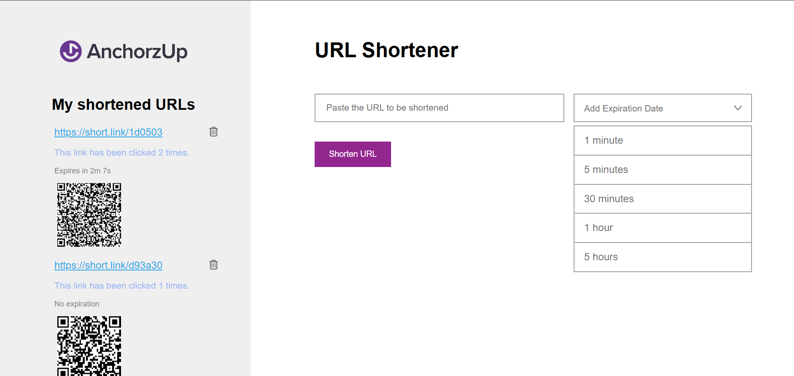

# AnchorzUpTask
This project is a **URL shortening service** that transforms long web addresses into short, easy-to-share links. 

### Key Features
- Generates a unique short link for each URL.
- Redirects users from the short link to the original URL.
- Allows users to set an expiration date for the short link.
- Users can delete short links from the UI.
- Tracks clicks for each short link and displays the count below the link.
- Generates a QR code for each short link for easy sharing.
- Uses a relational database (MySQL) to store original URLs and short codes.

### Technologies Used
- **Frontend:** HTML, CSS, JavaScript
- **Backend:** PHP with PDO for database interaction  
- **Database:** MySQL (relational database for storing original URLs and short codes)  
- **Server:** Apache (via XAMPP for local development)  

### UI View


### Link Management

- Links **expire automatically** only if an expiration time has been set.
- Links without an expiration time **do not expire automatically**.
- Users can manually expire a link by clicking the **delete icon** in the UI.
- Expired links (manually or automatically) will be **hidden from the interface** and will no longer redirect to the original URL.
- All link data **remains in the database** for analytics purposes.

### Database Structure
1. Table ` Originial_urls `
  
| Field          | Type     | Description                                              |
| -------------- | -------- | -------------------------------------------------------- |
| `id`           | INT      | Primary key, AUTO\_INCREMENT                             |
| `original_url` | VARCHAR  | Original URL, unique                                     |
| `total_clicks` | INT      | Total number of clicks from all short links for this URL |
| `created_at`   | DATETIME | Creation timestamp                                       |

2. Table `short_links`

| Field         | Type     | Description                                |
| ------------- | -------- | ------------------------------------------ |
| `id`          | INT      | Primary key, AUTO\_INCREMENT               |
| `original_id` | INT      | Foreign key referencing `original_urls.id` |
| `short_code`  | VARCHAR  | Unique short code                          |
| `clicks`      | INT      | Number of clicks for this short link       |
| `expires_at`  | DATETIME | Expiration timestamp for the short link    |
| `created_at`  | DATETIME | Creation timestamp                         |

## How to Run Locally
1. Clone the repository:
``` bash
git clone https://github.com/FloridaSuka/AnchorzUpTask.git
cd AnchorzUpTask
```
2. Import the MySQL database:
``` sql
CREATE DATABASE url_shortener;
USE url_shortener;

-- Import the tables `original_urls` and `short_links` from `database.sql`
```
3. Configure db_connect.php with your MySQL credentials:
``` php
$host = "localhost";
$db   = "url_shortener";
$user = "root";
$pass = "";
```
4. Start your local server (e.g., XAMPP/Apache) and navigate to:
``` arduino
http://localhost/AnchorzUpTask/
```
5. Use the UI to create short links, track clicks, and generate QR codes.

## Main Files
| File              | Description                                                        |
| ----------------- | ------------------------------------------------------------------ |
| `index.html`      | UI for creating and listing short links                            |
| `script.js`       | JS for managing links, fetching data, and generating QR codes      |
| `get_links.php`   | Fetches links from the database and returns JSON for the UI        |
| `shorten.php`     | Creates a short link and stores it in the database                 |
| `redirect.php`    | Redirects users to the original URL when the short link is clicked |
| `expire_link.php` | Sets `expires_at` to remove short links                            |
| `db_connect.php`  | MySQL database connection                                          |


